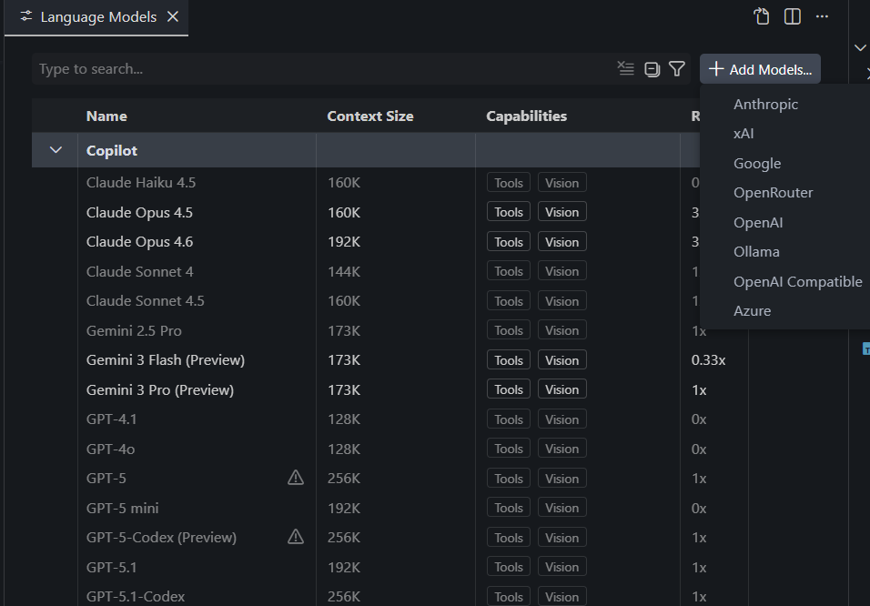
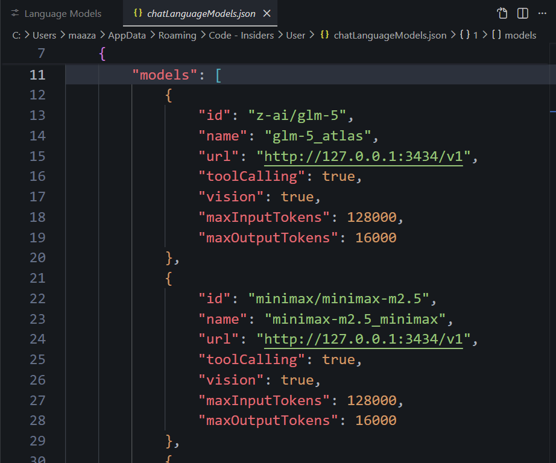

# VS Code OpenRouter Provider Proxy

Local OpenAI-compatible proxy and config web app that lets you pin specific OpenRouter models to specific providers.

## Why this project is useful

OpenRouter may route requests across different providers for the same model. That can reduce prompt-cache reuse and increase cost over time.

This project adds provider persistence by model:

- If a model is mapped (for example `z-ai/glm-5 -> atlas-cloud/fp8`), the proxy injects provider routing for that request.
- If a model is not mapped, requests pass through without provider injection.

Result: better cache consistency and more predictable provider behavior.

## Keywords

OpenRouter, VS Code Insiders, Copilot custom model, OpenAI-compatible endpoint, provider pinning, provider persistence, prompt caching, cache efficiency, LLM proxy, model routing, Bun runtime.

## Requirements

- VS Code Insiders (required for this custom model workflow)
- OpenRouter API key
- Bun runtime (this project only works with Bun)
- Windows PowerShell (for included scripts, you can directly run the server on any machine using bun run server.ts)

## Quick start

1. Install dependencies:

```powershell
bun install
```

2. Start the proxy:

```powershell
powershell -ExecutionPolicy Bypass -File .\start.ps1 -OpenUI
```

or:

```powershell
bun run server.ts
```

3. Open the local web UI and set your OpenRouter key:

- UI: `http://127.0.0.1:3434`
- API base URL: `http://127.0.0.1:3434/v1`
- Health: `http://127.0.0.1:3434/health`

## VS Code Insiders setup (OpenAI-compatible model)

1. Open Model Manager and add an OpenAI-compatible model.
2. Give it a display name.
3. Enter your API key (OpenRouter key).
4. Keep other options unchanged unless you know you need to change them.



5. Open `chatLanguageModels.json`:

- `Ctrl+Shift+P`
- run: `>Chat: Open Language Models JSON`

6. Add your model entry with the local proxy URL:

- `url`: `http://127.0.0.1:3434/v1`
- `id`: exact OpenRouter model id (must match OpenRouter exactly)
- `name`: any label you want in VS Code



## Important model/provider rules

- Model ids must exactly match OpenRouter model ids.
- Provider ids must exactly match OpenRouter provider ids.
- You can add many models in `chatLanguageModels.json`.
- For provider pinning to apply, each model also needs a mapping in server config (`modelProviders`).

## Managing server config

You can manage config in two ways:

- Web UI at `http://127.0.0.1:3434`
- File: `config.json`

The web UI can update key settings live, including:

- OpenRouter API key
- OpenRouter base URL
- `modelProviders` map (model -> provider)
- fallback behavior

If a model is missing from `modelProviders`, the proxy forwards the request without provider injection.

## Project files

- `server.ts`
	- Main Bun server.
	- Hosts the local web UI.
	- Exposes `/v1/*` OpenAI-compatible proxy routes.
	- Injects provider routing based on `modelProviders`.
	- Includes per-request logs and `/health` endpoint.

- `config.example.json`
	- Example template config.
	- Safe to share.

- `config.json`
	- Real local runtime config (includes secrets).
	- Ignored by git.

- `start.ps1`
	- Starts the Bun server.
	- Optional `-OpenUI` switch opens the web UI in browser.


- `create-shortcut.ps1`
	- Creates a Desktop shortcut (`VS Code OpenRouter Provider Proxy.lnk`) that launches `start.ps1`.
	- Useful for double-click startup.

- `screenshots/`
	- Setup screenshots referenced in this README.

- `package.json`
	- Bun scripts (`start`, `dev`) and dependencies metadata.

- `tsconfig.json`
	- TypeScript compiler configuration.

## Security note

Never commit `config.json` or any file containing your API key.
